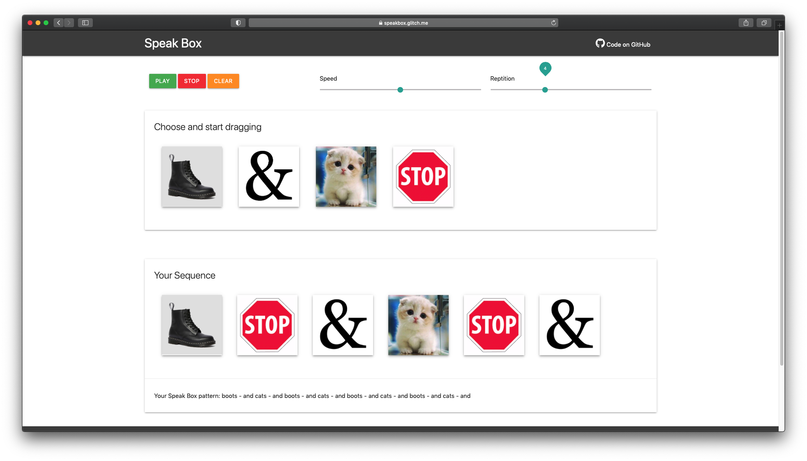

# Speak Box

[Live demo on glitch.com](https://speakbox.glitch.me/)

## Intro

Speak Box is a beat box sequencer built with the speech synthesis functionality from the <a href="https://developer.mozilla.org/en-US/docs/Web/API/Web_Speech_API">Web Speech API</a>, altogether with <a href="https://github.com/SortableJS/sortablejs">SortableJS</a>, and <a href="https://materializecss.com/">Materialize</a>.

More information on my [Wordpress Blog](https://jason1996429.wordpress.com/2020/11/01/hello-computer-wk-1-speak-box/)